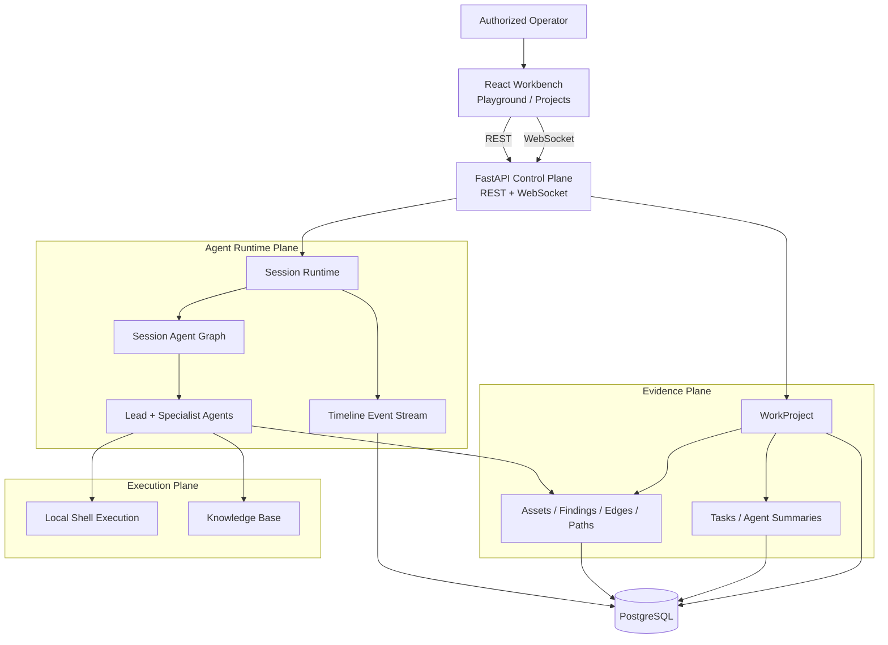
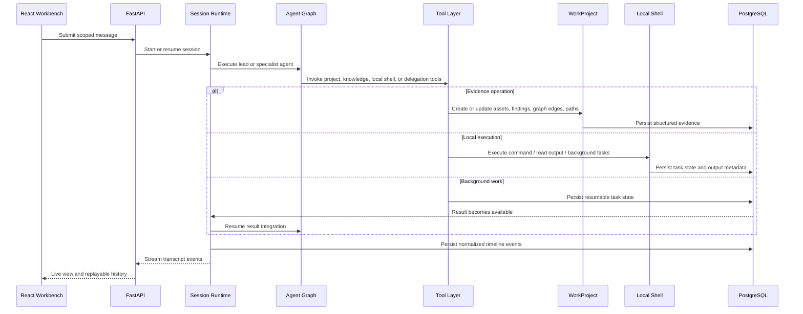
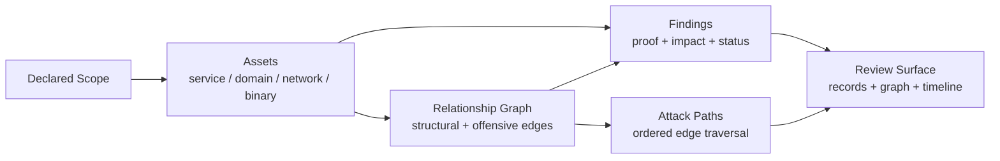

<p align="center">
  
</p>

<p align="center">
  <strong>English</strong> ·
  <a href="README_zh.md">中文</a>
</p>

<p align="center">
  <a href="#architecture">Architecture</a> ·
  <a href="#runtime-flow">Runtime Flow</a> ·
  <a href="#evidence-model">Evidence Model</a> ·
  <a href="#execution">Execution</a> ·
  <a href="#expert-team">Expert Team</a>
</p>

<p align="center">
  <strong>Open-source red-team multi-agent collaboration platform for authorized penetration testing, vulnerability discovery, code auditing, and security research.</strong>
</p>

---

> :warning: **Security Notice**
>
> This project is intended only for security testing, risk assessment, and academic research within legal and explicitly authorized scopes. It must not be used for unlawful, unauthorized, or destructive purposes.
>
> This project does not grant permission to test, access, scan, or affect any third-party systems, networks, services, accounts, or data.
>
> **The author is not responsible for any consequences, losses, damages, legal liabilities, or unlawful behavior caused by users.**

## Overview

XuanMu RedTeam Agent is a control-plane-oriented red team multi-agent platform. It combines a React operator console, a FastAPI management plane, a session-based multi-agent runtime, project-scoped evidence records, and a local command execution layer.

The design goal is to make agent-assisted security work operationally bounded and reviewable. Conversations are not treated as the only source of truth. Project scope, assets, findings, relationship graph edges, attack paths, and replayable timeline events are represented as explicit application data.

## Architecture



XuanMu separates the system into four architectural planes:

| Plane | Scope |
| --- | --- |
| Control plane | Users, system configuration, agents, sessions, WorkProjects, and system config. |
| Runtime plane | Multi-agent session execution, live event streaming, long-running task continuity, history projection, and timeline replay. |
| Evidence plane | Project scope, assets, findings, relationship graph, attack paths, task progress, and per-agent summaries. |
| Execution plane | Local shell command execution, background tasks, and knowledge base integration. |

This separation is reflected in the repository structure: routers and handlers expose application contracts, services own domain behavior, models define persistent state, and the React workbench consumes the stable REST/WebSocket surface.

## Runtime Flow



The runtime is designed for assessments that outlive a single browser interaction. The frontend can stream live events, reload persisted timeline pages, switch sessions, inspect subagent work, and open project records without depending on provider-specific model events. Long-running commands and specialist tasks are represented as application state, so results can be integrated after they complete instead of forcing the operator to wait in a blocking turn.

## Evidence Model



WorkProject is the durable evidence boundary for professional review. Assets are graph nodes. Relationships describe architecture or attack progression. Findings attach proof and impact to affected assets and, when needed, to a specific relationship. Attack paths are ordered traversals through the graph.

| Data object | Role in the assessment |
| --- | --- |
| WorkProject | Assessment container for owners, type, status, scope assets, sessions, tasks, and summaries. |
| Asset | Normalized target or discovered object: service, domain, network, or binary. |
| Finding | Security observation with severity, status, proof, impact, and optional graph binding. |
| Graph edge | Directed relationship between two assets, either structural or offensive. |
| Attack path | Ordered path over graph edges, used to reconstruct access or impact progression. |

This model keeps evidence independent from model context. Agent summaries can remain compact while durable facts stay queryable, visualizable, and reviewable.

## Execution

Commands are executed directly on the host machine via Python asyncio subprocess (no Docker required). The execution layer supports:

- **Synchronous command execution** — run shell commands and get results with timeout control
- **Background task management** — start long-running tasks and receive notifications on completion
- **Output file reading** — read command output by line range
- **Skill system** — load and execute reusable skill definitions from `.xuanmu/agents/skills/`
- **Knowledge base** — find, load, create, and update structured knowledge documents

## Technical Highlights

| Highlight | Description |
| --- | --- |
| Multi-agent orchestration | A lead agent coordinates specialist agents for intelligence gathering, validation, code audit, reverse analysis, and cryptanalysis. |
| Project evidence plane | WorkProject turns transient investigation output into persistent records, graph relationships, paths, tasks, and summaries. |
| Replayable event timeline | The UI consumes normalized timeline events that can be streamed live or loaded later as history. |
| Local execution | Commands run directly on the host machine via subprocess, no Docker required. |
| Knowledge base | Structured security methodology documents that agents can reference during work. |
| Operator workbench | The frontend combines chat, project records, graph review, and command execution into one workflow. |

## Expert Team

| Code | Name | Role | Responsibilities |
| --- | --- | --- | --- |
| `cso` | XuanMu (玄幕) | Security Lead | Task decomposition, team coordination, result integration |
| `cae` | ShouZhuo (守拙) | Code Audit Engineer | Source code auditing, dependency review, remediation verification |
| `cie` | GuanXing (观星) | Intelligence Engineer | Intelligence gathering, asset discovery, relationship mapping |
| `cpe` | PoJun (破军) | Penetration Engineer | Penetration testing, vulnerability validation, impact confirmation |
| `cre` | SuYuan (溯源) | Reverse Engineer | Reverse analysis, firmware disassembly, binary unpacking |
| `cce` | PoZhen (破阵) | Cryptography Engineer | Cryptographic analysis, key review, security assessment |

## Repository Layout

```text
core/        Agent specs, runtime, task runtime, delegation, context, tools
service/     Domain services for agent, users, projects
router/      FastAPI route declarations
handler/     HTTP and WebSocket request handling
model/       SQLModel database models
schema/      Pydantic API contracts
web/         React workbench and landing page
.xuanmu/     Runtime configuration, agent prompts, knowledge files, logs
```

## Quick Start

```bash
# 1. Setup (first time)
bash setup.sh

# 2. Edit config with your LLM API key
# vi .xuanmu/config.json

# 3. Start
bash start.sh

# 4. Open browser
# http://localhost:8000
#   Login: admin@admin.com / admin123
```

## Acknowledgments

This project is a fork of [Z3r0](https://github.com/yv1ing/Z3r0), an open-source red team collaboration workbench. We extend our thanks to the original authors and contributors.

## License

This project is licensed under the [MIT License](LICENSE).
