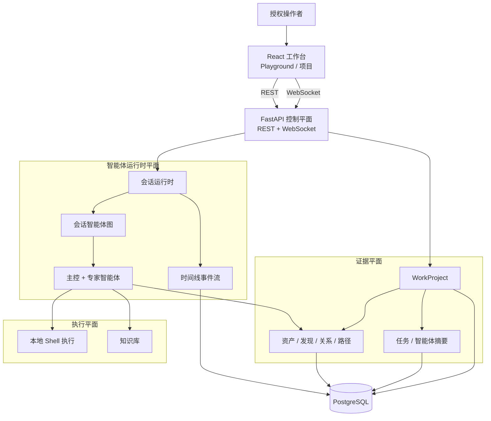
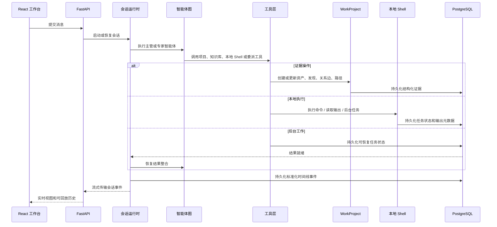
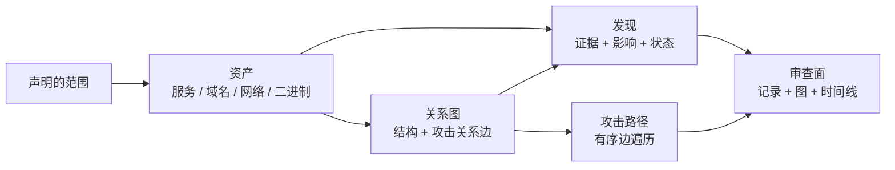
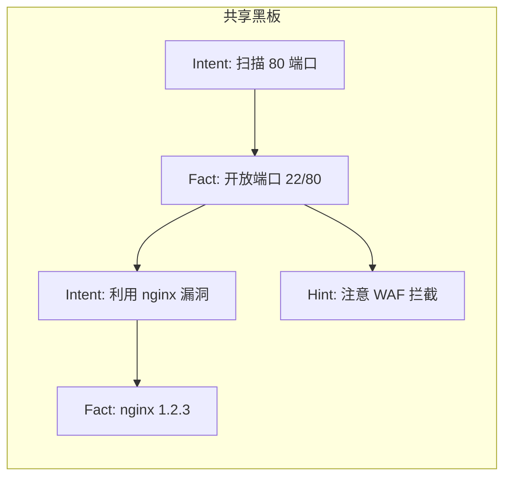

<p align="center">
  
</p>

<p align="center">
  <a href="README.md">English</a> ·
  <strong>中文</strong>
</p>

<p align="center">
  <a href="#总体架构">总体架构</a> ·
  <a href="#运行链路">运行链路</a> ·
  <a href="#证据模型">证据模型</a> ·
  <a href="#执行层">执行层</a> ·
  <a href="#智能体团队">智能体团队</a>
</p>

<p align="center">
  <strong>面向授权渗透测试、漏洞挖掘、代码审计与安全研究的开源红队多智能体协作平台。</strong>
</p>

---

> :warning: **安全声明**
>
> 本项目仅限在合法且获得明确授权的范围内用于安全测试、风险评估和学术研究，严禁用于任何违法、未授权或具有破坏性的用途。
>
> 本项目不授予任何测试、访问、扫描或影响第三方系统、网络、服务、账号或数据的权限。
>
> **作者不对使用者造成的任何后果、损失、损害、法律责任或违法行为负责。**

## 概览

玄幕红队智能体（XuanMu RedTeam Agent）是面向红队协作的控制平面型多智能体平台。它将 React 操作台、FastAPI 管理平面、会话级多智能体运行时、项目级证据记录和本地命令执行层组合在一起。

设计目标是让智能体辅助的安全工作具备清晰边界和可复核性。对话不是唯一事实来源；项目范围、资产、漏洞发现、关系图、攻击路径和可回放时间线都作为显式应用数据管理。

## 总体架构



玄幕将系统划分为四个架构平面：

| 平面 | 范围 |
| --- | --- |
| 控制平面 | 用户、系统配置、智能体、会话、WorkProject 和系统配置。 |
| 运行时平面 | 多智能体会话执行、实时事件流、长周期任务连续性、历史投影和时间线回放。 |
| 证据平面 | 项目范围、资产、漏洞发现、关系图、攻击路径、任务进度和智能体摘要。 |
| 执行平面 | 本地 Shell 命令执行、后台任务和知识库集成。 |

## 运行链路



## 证据模型



WorkProject 是可复核审查的持久化证据边界。资产是图节点，关系描述架构或攻击推进，发现将证据和影响关联到受影响资产，攻击路径是图中边的有序遍历。

| 数据对象 | 在评估中的角色 |
| --- | --- |
| WorkProject | 评估容器，包含所有者、类型、状态、范围资产、会话、任务和摘要。 |
| Asset | 标准化目标或发现对象：服务、域名、网络或二进制。 |
| Finding | 安全观察，包含严重度、状态、证据、影响和可选的关系图绑定。 |
| Graph edge | 两个资产之间的有向关系，结构型或攻击型。 |
| Attack path | 图边上的有序路径，用于重构访问或影响推进。 |

## 共享黑板（Blackboard）

黑板是 Cairn 风格的共享推理图，为多智能体协作提供 **Stigmergy（间接协调）** 机制。所有智能体通过读写同一张黑板来共享信息，而不是通过对话互相打断。



### 三种节点

| 类型 | 含义 | 生命周期 |
| --- | --- | --- |
| **Fact** | 已确认的客观发现 | proposed → confirmed / rejected |
| **Intent** | 声明的探索方向 | proposed → in_progress → confirmed / rejected |
| **Hint** | 人类或智能体注入的指引 | 持久存在 |

### 智能体工作流

1. **读黑板** — 了解当前全貌：已有 Fact、进行中的 Intent、他人注入的 Hint
2. **写 Intent** — 开辟新方向前先声明意图
3. **执行后写 Fact** — 确认结果，链接到对应的 Intent
4. **标记状态** — 此路不通则标记 rejected，避免重复劳动

黑板层与原有证据平面（Asset / Finding / GraphEdge）互补：证据层记录「发现了什么」，黑板层记录「为什么查、查到什么、下一步查什么」。

## 执行层

命令通过 Python asyncio 子进程在宿主机上直接执行（无需 Docker）。执行层支持：

- **同步命令执行** — 运行 Shell 命令并获取结果，支持超时控制
- **后台任务管理** — 启动长周期任务，完成后收到通知
- **输出文件读取** — 按行范围读取命令输出
- **技能系统** — 从 `.xuanmu/agents/skills/` 加载可复用的技能定义
- **知识库** — 查找、加载、创建和更新结构化知识文档

## 技术亮点

| 亮点 | 描述 |
| --- | --- |
| 多智能体编排 | 主管智能体协调专家智能体进行情报、验证、审计、逆向和密码分析。 |
| 项目证据平面 | WorkProject 将临时调查输出转化为持久记录、关系图和摘要。 |
| 可回放事件时间线 | 前端消费标准化时间线事件，可实时流式传输或后期加载。 |
| 本地命令执行 | 命令通过子进程直接在宿主机运行，无需 Docker。 |
| 知识库 | 结构化的安全方法论文档，智能体可在工作中参考。 |
| 操作台 | 前端整合对话、项目记录、关系图和命令执行到同一工作流。 |
| 共享黑板 | Cairn 风格的 Fact-Intent 推理图，实现智能体间间接协调与推理过程可追溯。 |

## 智能体团队

| 代号 | 名称 | 角色 | 职责 |
| --- | --- | --- | --- |
| `cso` | 玄幕 (XuanMu) | 安全主管 | 任务分解、团队协调、结果整合 |
| `cae` | 守拙 (ShouZhuo) | 代码审计专家 | 源码审计、依赖审查、修复验证 |
| `cie` | 观星 (GuanXing) | 情报侦察专家 | 情报收集、资产发现、关系测绘 |
| `cpe` | 破军 (PoJun) | 渗透测试专家 | 渗透测试、漏洞验证、影响确认 |
| `cre` | 溯源 (SuYuan) | 逆向分析专家 | 逆向分析、固件反汇编、二进制脱壳 |
| `cce` | 破阵 (PoZhen) | 密码分析专家 | 密码分析、密钥审查、安全评估 |

## 仓库结构

```text
core/        智能体规格、运行时、任务运行时、委派、上下文、工具
service/     领域服务：智能体、用户、项目
router/      FastAPI 路由声明
handler/     HTTP 和 WebSocket 请求处理
model/       SQLModel 数据库模型
schema/      Pydantic API 契约
web/         React 工作台和着陆页
blackboard/  共享推理图（黑板）模块
  model/      SQLModel 数据库模型
  schema/     Pydantic API 契约
  service/    领域服务
  handler/    HTTP 处理
  router/     FastAPI 路由
.xuanmu/     运行时配置、智能体提示词、知识文件、日志
```

## 快速开始

```bash
# 1. 首次安装
bash setup.sh

# 2. 编辑配置文件，填入 LLM API Key
# vi .xuanmu/config.json

# 3. 启动服务
bash start.sh

# 4. 打开浏览器访问
# http://localhost:8000
#   登录: admin@admin.com / admin123
```

## 致谢

本项目基于 [Z3r0](https://github.com/yv1ing/Z3r0) 二次开发，感谢原作者的出色工作。

## 许可证

本项目基于 [MIT 许可证](LICENSE) 开源。
