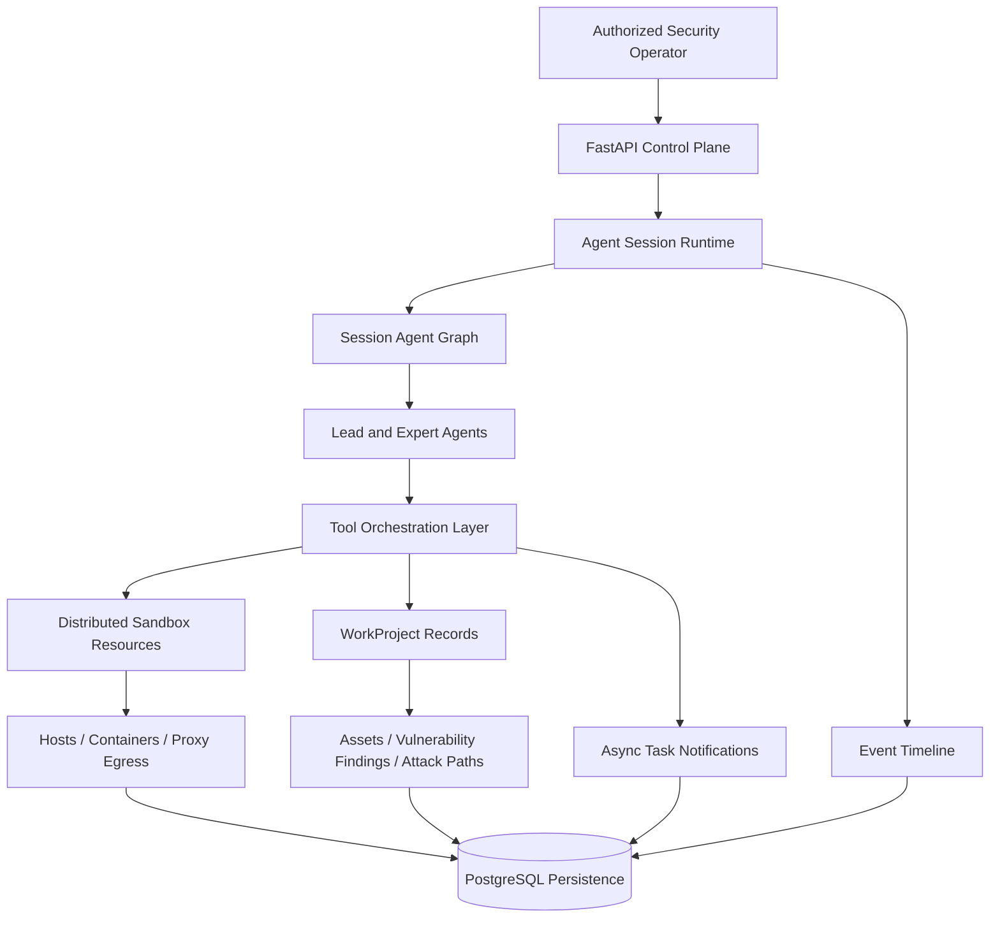
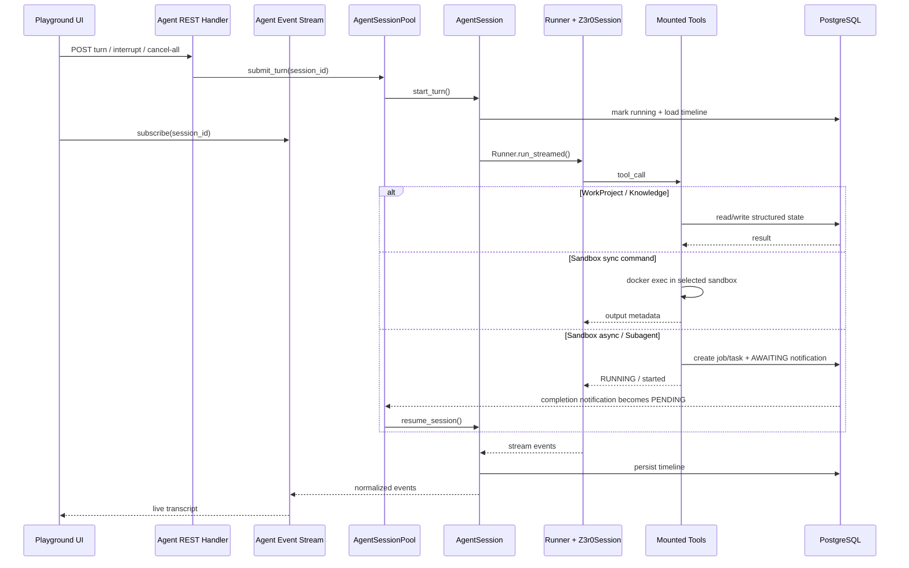

# Overview

Z3r0 is an open-source red team collaboration workbench built around multi-expert agent collaboration for authorized penetration testing, vulnerability discovery, code auditing, and security research.

The platform mirrors the operating model of a real red team. A lead agent coordinates expert agents for intelligence gathering, penetration testing, code auditing, reverse analysis, and cryptanalysis. As work progresses, assets, relationships, vulnerability findings, and attack paths are continuously captured as structured evidence, making the security workflow observable, auditable, and reproducible.

> :warning: Security Notice
>
> This project is intended only for security testing, risk assessment, and academic research within legal and explicitly authorized scopes. It must not be used for unlawful, unauthorized, or destructive purposes, including but not limited to unauthorized intrusion into computer systems or theft of others' data.
>
> This project does not grant permission to test, access, scan, or affect any third-party systems, networks, services, accounts, or data.
>
> **The author is not responsible for any consequences, losses, damages, legal liabilities, or unlawful behavior caused by users.**

## Core Capabilities

| Capability | Description |
| --- | --- |
| Multi-agent red team orchestration | The lead agent coordinates expert agents to break down intelligence, vulnerabilities, analysis, and path planning into tasks that can be carried out in parallel. |
| Session-level runtime architecture | Each session binds an independent agent graph and tool snapshot, supporting interruption, cancellation, recovery, and continuous execution. |
| Background subagent tasks | Subagents can run as persistent background tasks and wake the parent agent for result integration and follow-up planning. |
| Asynchronous sandbox task system | Long-running commands execute as asynchronous tasks with persisted state, preventing tool execution from blocking the main workflow. |
| Controlled sandbox execution environment | Skill loading, command execution, and output reading are wrapped in the sandbox toolchain for isolated execution and traceable results. |
| Distributed test management | Multiple hosts, images, and containers are managed to support parallel testing, environment isolation, and resource scheduling. |
| Proxy egress environment isolation | Sandbox containers can bind HTTP, HTTPS, and SOCKS5 proxy egress to reduce exposure of the operator environment. |
| Project-oriented red team workflow | WorkProject centralizes assets, vulnerability findings, relationship graphs, and attack paths so the process remains traceable and reviewable. |
| Replayable event timeline | Conversations, tool calls, subtasks, errors, and result events are continuously recorded for real-time display and historical replay. |

## Architecture

The architecture uses FastAPI as the control plane for sessions, projects, and execution resources. The core runtime is driven by agent sessions, which organize the lead agent and expert agents through the session agent graph. The tool orchestration layer connects sandbox execution, project records, asynchronous tasks, and the event timeline. Distributed sandbox resources provide isolated execution environments for authorized security testing, while WorkProject persists assets, vulnerability findings, and attack paths as traceable and reviewable project evidence. PostgreSQL stores session state, task progress, vulnerability findings, asset relationships, attack paths, and replayable events so the full workflow remains traceable and reviewable.

## Expert Team

| Code | Name | Role | Responsibilities |
| --- | --- | --- | --- |
| `cso` | Z3r0 | Chief Security Lead | Task decomposition, team coordination, result integration |
| `cae` | V3ra | Code Audit Engineer | Source code auditing, dependency review, remediation verification |
| `cie` | L1ly | Intelligence Gathering Engineer | Intelligence gathering, asset discovery, relationship mapping |
| `cpe` | Fr4nk | Penetration Testing Engineer | Penetration testing, vulnerability validation, impact confirmation |
| `cre` | J4m3 | Reverse Analysis Engineer | Reverse analysis, firmware disassembly, binary unpacking |
| `cce` | Nu1L | Cryptography Engineer | Cryptographic analysis, key review, security assessment |

## Runtime Sequence

